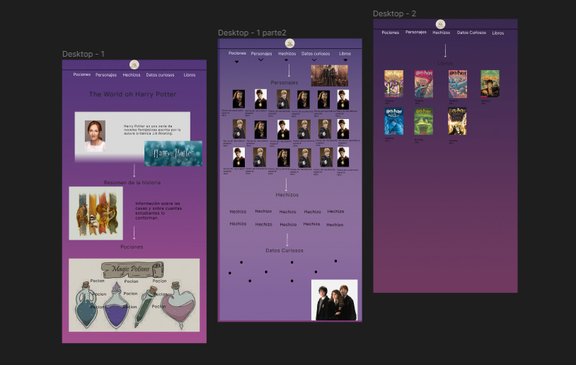
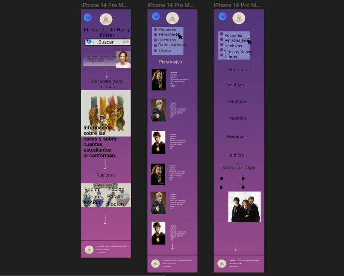
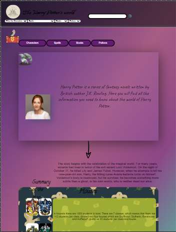

## Definicion del producto

### Nuestros usuarios🚀

Son una comunidad con gustos de las peliculas y libros de Harry Potter los cuales quieren conocer un poco mas sobre informacion de los personajes, hechizos, pociones y libros que se usan.
***
### Historias de usuario 📌

<h4><b>Caso 1</b></h4>

*DADO un usuario fan de la Saga de Harry Potter*

*CUANDO el usuario quiere ver a todos los personajes*

*ENTONCES hace click en el botón de "Characters" y se le mostrará al usuario las cartas con información de todos los personajes.*

<h4><b>Caso 2</b></h4>

*DADO un usuario fan de la Saga de Harry Potter*

*CUANDO el usuario quiere ver a todos los personajes ordenados en orden albeticamente para poder tener una mejor vista de todos*

*ENTONCES hace click en el botón "Filter for Character" y se le mostrará al usuario las opciones de filtrado como "Alive", "Dead", "A-Z","Z-A", "Species buman","Species  half-giant.*

<h4><b>Caso 3</b></h4>

*DADO un usuario fan de la Saga de Harry Potter*

*CUANDO el usuario quiere ver los datos de un personajes en específico*

*ENTONCES escribe en la barra de búsqueda y se le mostrará instantáneamente la(s) tarjeta(s) que coincidan con su búsqueda..*
***
### Nuestro diseño ✒️ 🛠️

Para elaborar nuestro prototipo primero revisamos diferentes paginas e ibamos sacando diferentes ideas de las pagina que ibamos viendo. Elaboramos nuestro prototipo en Figma y pedimos feedback de compañeras y solicitamos una OH.

° Nuestro prototipo de Figma para la vista de PC.

° Nuestro prototipo de Figma para la vista de móvil.

° Vista de nuestra página terminada.

